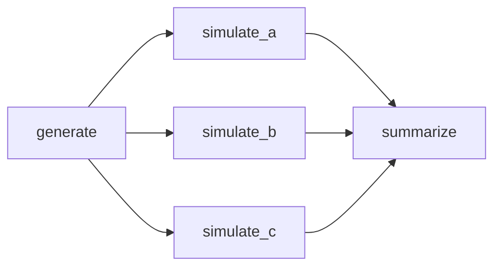

# Reproducible Experiment Runner

A local Python CLI for file-based task workflows, verified result reuse, and recovery of completed work after interruption. It supports Python 3.12 on macOS and Linux. [Try the example](#quick-start) or read the [real three-run demo](docs/demo.md).

## Why I Built This

Simulation scripts often form a dependency graph: generate inputs, run independent branches, then combine results. Repeating every script after one parameter changes wastes completed work. I wanted a local tool that makes dependencies and outputs explicit, reuses only verified artifacts, and can recover committed work after interruption.

## What It Does

`runner validate` checks a versioned YAML workflow before launching commands. `runner run` starts ready tasks with a worker limit, copies declared inputs into private attempt directories, verifies declared outputs, and records attempts in SQLite. It can restore hash-verified cache entries instead of launching a task. `runner status` reads a stored run, and `runner resume` rechecks the original workflow and current files to retain, restore, or execute work. The [design](docs/design.md) defines the full contract.

## Quick Start

If the repository is private, cloning requires an account with access. The block uses HTTPS Git authentication; if your account is authenticated only in GitHub Desktop, clone `RichardZ-code/reproducible-experiment-runner` there and continue from the `cd` line in that new checkout. Use an installed Python **3.12** interpreter. If `python3.12` is not on `PATH`, set `PYTHON312` to the command or path for an installed 3.12 interpreter before running the block. The example files come from the source checkout, not the wheel.

```sh
git clone https://github.com/RichardZ-code/reproducible-experiment-runner.git
cd reproducible-experiment-runner
PYTHON312=${PYTHON312:-python3.12}
"$PYTHON312" -m venv .venv
. .venv/bin/activate
python -m pip install .
runner --help
runner validate examples/simulation/workflow.yaml
runner run examples/simulation/workflow.yaml --workers 4
runner run examples/simulation/workflow.yaml --workers 4
```

Keep the environment activated in that shell. In a new shell, return to the checkout and run `. .venv/bin/activate`. The first run executes five tasks. An unchanged second `run` creates a **new run ID** and can restore five verified results without launching their commands. Both commands print their own run ID and manifest path. The [demo](docs/demo.md) includes a changed-input case and independent hash checks.

The workflow's directory is its workspace. The example publishes `out/input.json`, `out/a.json`, `out/b.json`, `out/c.json`, and `out/summary.json` there. State and logs live under `examples/simulation/.repro/`:

| Location within the workflow directory | Purpose |
| --- | --- |
| `.repro/state.sqlite3` | Authoritative run, invocation, attempt, and artifact records |
| `.repro/cache/v1/<key>/` | Verified cache entries, when enabled |
| `.repro/runs/<run-id>/attempts/<task>/<number>/` | Private `work/`, `stdout.log`, and `stderr.log` |
| `.repro/runs/<run-id>/manifest.json` | Derived JSON snapshot of committed state |

For `status` or `resume`, substitute the ID printed by `runner run` for `RUN_ID`. These commands look for `.repro` in the **current directory**, so enter the example workspace first:

```sh
(
  cd examples/simulation
  runner status RUN_ID
  runner resume RUN_ID
)
runner run examples/simulation/workflow.yaml --no-cache
```

The literal `RUN_ID` above is a placeholder. `status` reads recorded facts; a stored `running` state does not prove a process is alive. `resume` creates another invocation of the **same** logical run, checks its saved workflow contract, and revalidates current inputs and outputs. Incompatible workflow edits require a new run. A no-cache run still records state and manifests; its resume can retain verified completed work while bypassing cache reads and writes. For controlled cold/warm measurements, use the [isolated benchmark harness](benchmarks/README.md) rather than deleting `.repro`, which also holds recovery history.

## Example Workflow

The included [workflow](examples/simulation/workflow.yaml) uses schema version 1, command argument lists, and declared inputs and outputs. A seeded generator creates synthetic integers; three independently configured recurrence branches consume them; the final task combines all three results. Each script and configuration is a declared input. No external service or dataset is used.



The default seed is 1729, with 128 samples and 120 recurrence steps per branch. Changing only `config/b.json` from increment 5 to 6 makes `simulate_b` and `summarize` execute while `generate`, `simulate_a`, and `simulate_c` can restore. The [example guide](examples/simulation/README.md) explains the arithmetic and files.

## Architecture

The CLI validates the workflow before a single-owner scheduler admits ready tasks. The scheduler stages declared inputs, computes identity, chooses verified cache restoration or subprocess execution, then verifies and publishes outputs. A successful SQLite commit makes those artifacts eligible for dependent tasks. The manifest is generated from a committed database snapshot. Cache entries, workspace files, and SQLite have ordered publication steps, not one shared transaction. The [architecture contract](docs/design.md#b-architecture-and-ownership) and [publication decisions](docs/design-decisions.md) give the boundaries.

## Execution Model

`--workers N` bounds concurrently active task attempts; the default is four. A free slot does not bypass dependencies: a task becomes ready only after its prerequisites have accepted outputs. Each launched command runs with an argument list in its own staged directory, with separate stdout and stderr logs. Exit code zero is insufficient if a declared output is missing, invalid, or changed before acceptance. Independent branches can continue after another branch fails, while descendants of the failed task are blocked. See [development setup](docs/development.md) for CLI details.

## Content-Addressed Caching

The versioned task key covers the logical command, declared script/data/config paths and bytes, direct-dependency output hashes, declared outputs, runner semantics, and a selected Python/OS/package environment fingerprint. A hit verifies metadata and every stored artifact byte before restoring independent copies. A matching directory name alone does not establish validity. Downstream identity uses effective output bytes, so a producer can rerun without forcing its consumer to rerun if those bytes remain the same. `--no-cache` bypasses cache storage while retaining input/output checks, SQLite records, and manifests. The cache is deliberately [non-hermetic](docs/design.md#i-cache-identity-and-environment).

## Failure and Recovery Semantics

An ordinary failed task keeps its history, blocks its descendants, and allows unrelated branches to finish. On handled Ctrl-C or SIGTERM, the runner stops admission and terminates child process groups it owns, with a bounded grace period. Abrupt parent death cannot run those handlers and may leave a child writing in an old private attempt directory. `resume` does not promote incomplete work just because a file exists: it verifies committed results for retention, restores verified cache entries when enabled, or starts a new attempt. A no-cache run can retain valid committed outputs, but must execute incomplete or invalid work. External side effects of trusted commands are not exactly once. The [recovery contract](docs/design.md#k-sqlite-ownership-and-resume) describes crash boundaries.

## Reproducibility

Each invocation's manifest records its workflow, selected environment and Git observation, attempts, input and output hashes, task resolutions, and timing. Inspect the path printed by `run` or `resume`; `status` reads SQLite without rewriting JSON. SQLite is authoritative: a crash may leave an older complete manifest, and `resume` rebuilds it after revalidation. Git provenance can be unavailable outside a repository; a dirty flag does not archive a patch, and a cache restoration does not identify the original producer's Git revision. Output bytes can be deterministic for declared inputs while run IDs, timings, and reuse history differ. See the [manifest decisions](docs/design-decisions.md#p07-example-provenance-and-manifest-decisions).

## Benchmarks

The selected [P09 raw dataset](benchmarks/results/mac-arm64-20260928-p09-scoped/samples.jsonl) has five valid measured repetitions per condition, with 65 measured observations total. External CLI wall time includes process and runner overhead. It was collected on an Apple M3 Mac (eight reported logical cores, 16 GiB), macOS 26.6.2 arm64, Python 3.12.14 and SQLite 3.53.1, under scoped process-control permission. The measured checkout was dirty at revision `7f50175`. Its recorded code/workload fingerprint identifies the measured source; the current `executor.py` differs after the P12 publication-error correction. The [protocol and exclusions](benchmarks/README.md) and [full results](benchmarks/results/mac-arm64-20260928-p09-scoped/summary.md) describe the context and limits.

| Condition | Median wall time | Verified task disposition |
| --- | ---: | --- |
| 24 waiting tasks, no cache, 1 worker | 7.7373 s | 24 executed |
| 24 waiting tasks, no cache, 8 workers | 1.2752 s | 24 executed; 6.0677× ratio |
| Seeded computation, no cache, 1 worker | 0.7831 s | 5 executed |
| Seeded computation, no cache, 4 workers | 0.3991 s | 5 executed; 1.9621× ratio |
| Seeded computation, 4 workers, cold | 0.4490 s | 5 executed |
| Same workspace, unchanged warm | 0.1838 s | 5 restored; 59.0603% median reduction |
| Same workspace, branch b changed | 0.3927 s | 2 executed, 3 restored |

The computation profile used seed 1729, 5,000 samples, and 1,000 steps per branch. The 24-task result measures scheduling of 0.25-second waits, not scientific compute acceleration. Ratios divide **unrounded** one-worker medians by comparison medians; warm reduction is `100 × (cold median − warm median) / cold median`. Controlled interruption trials also verified resumed outputs, with remaining-work timings in the [full results](benchmarks/results/mac-arm64-20260928-p09-scoped/summary.md); they are not a generic recovery speedup. OS caches were not cleared, allowed-core allocation and physical load were not independently verified, and five trials do not establish a population confidence interval. Demo times and CI smoke are correctness observations, not replacements for these measurements.

## Testing

The suite covers validation, scheduling, caching, interruption/recovery, provenance, packaging, and the benchmark harness. The [P12 hosted run](https://github.com/RichardZ-code/reproducible-experiment-runner/actions/runs/36487731537) passed on Ubuntu 24.04 x86_64 and macOS 15 arm64 at commit `7b43117`: each job reported 254 tests with zero skips, Ruff checks, wheel and source builds, clean consumer installations, and benchmark smoke. A later [documentation-only run](https://github.com/RichardZ-code/reproducible-experiment-runner/actions/runs/36488661541) passed the same checks at `91a7030`. After the development dependencies are installed as described in the contributor setup, run the current checkout's suite with `.venv/bin/python -m pytest`; contributor setup and hosted evidence are in [development](docs/development.md) and [CI verification](docs/ci.md). The [progress record](docs/progress.md) gives later release evidence.

## Design Decisions

The [design](docs/design.md) is the accepted behavior contract, and the [decision record](docs/design-decisions.md) explains choices such as explicit file ownership, private attempts, environment-aware keys, short SQLite transactions, and one workspace owner. The [adversarial verification record](docs/verification.md) links important behavior claims to tests and demonstrations.

## Repository Structure

The main paths are:

```text
src/repro_runner/      CLI, scheduler, cache, SQLite, and manifests
examples/simulation/   Source-only seeded workflow and scripts
tests/                 Behavioral and packaging checks
benchmarks/            Harness, fixtures, raw samples, and summaries
requirements/          Platform development locks
docs/                  Demo, design, setup, verification, and progress
```

Start with the [demo](docs/demo.md), [phase progress](docs/progress.md), or [MIT license](LICENSE) as needed.

## Limitations

This is a local, single-owner workspace runner for declared regular-file artifacts under its documented path rules. Commands are trusted, not OS-sandboxed; undeclared dependencies, ambient state, external services, and side effects are outside the cache identity. There is no exactly-once guarantee, automatic cache eviction, remote cache, or cluster execution. Handled-signal and controlled-interruption tests do not prove survival of every power-loss or orphan-process scenario. The verified platform baseline is Python 3.12 on the cited Linux/macOS CI matrix; other platforms are unverified.

## Future Work

The final audit closed in P12. The [progress record](docs/progress.md) distinguishes prepared release work from approved publication and verification. Broader environment capture and cache maintenance are possible later work, but neither is implemented or promised here.
